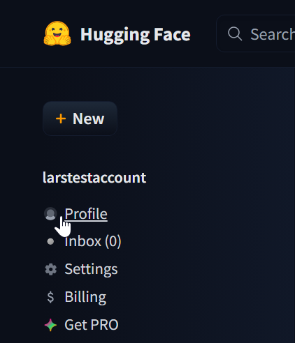
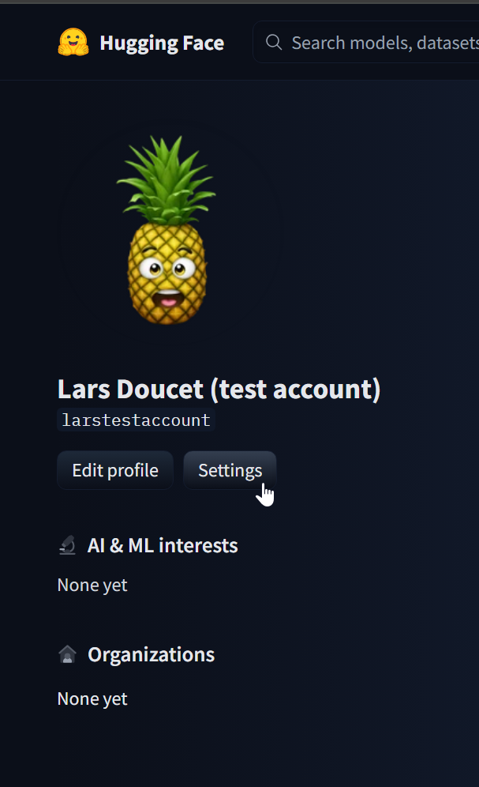
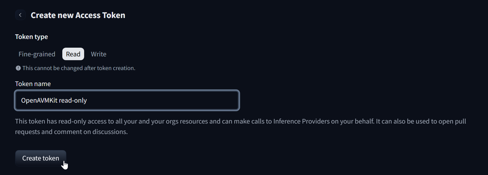
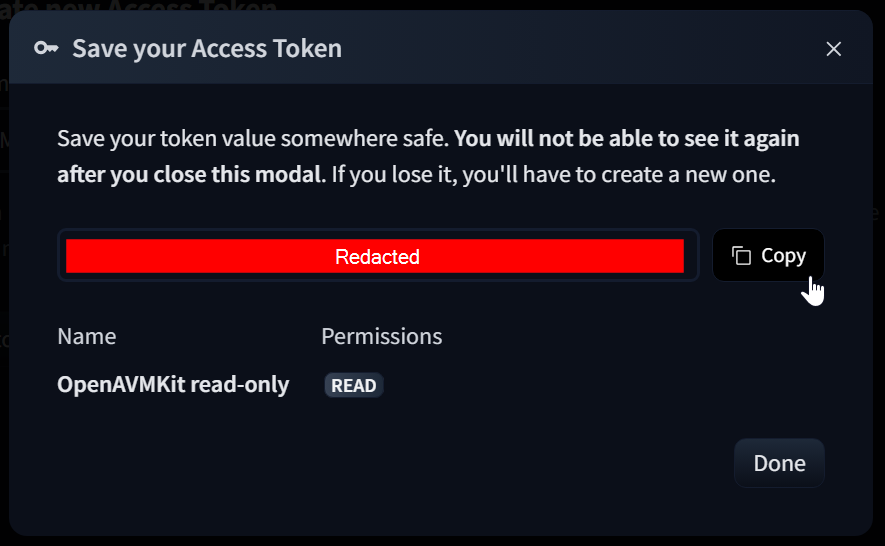
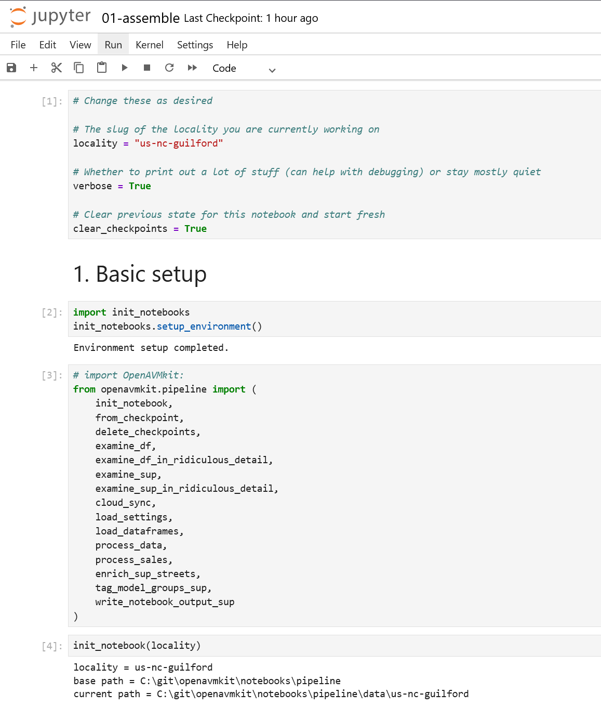

# Getting Started

## Setting up Python Environment

Follow these steps to install and set up `OpenAVMKit` on your local environment.

### 1. Clone the Repository

Start by cloning the repository to your local machine:

_(This command is the same on Windows, MacOS, and Linux):_
```bash
git clone https://github.com/larsiusprime/openavmkit.git
cd openavmkit
```

This command will clone the repository to your local machine, store it under a folder named `openavmkit/`, and then navigate to that folder.

### 2. Install Python

If you don't have Python on your machine, you'll need to install it.

OpenAVMKit is tested on **Python 3.10 and 3.11**.

* If you are **developing** or running the repo from source, either version works.
* If you just want to `pip install openavmkit` from PyPI, you’ll need **≥ 3.11** (that’s the minimum version required by the pre-built wheels).

If you already have Python installed, but you're not sure which version of Python you have installed, you can check by running this command:

```bash
python --version
```

If you have Python installed, you should see the version number printed to the console.

If you don't have Python installed, you can get the supported versions here:

- [Download Python 3.10.11](https://www.python.org/downloads/release/python-31011/)  
- [Download Python 3.11.9](https://www.python.org/downloads/release/python-3119/)  

If you have the wrong version of Python installed, you can download the correct version from one of the links above, and then install it. Be very careful to make sure that the new version of Python is available in your `PATH`. (If you don't know what the means, here is a [handy tutorial on the subject](https://realpython.com/add-python-to-path/)).


### 3. Set up a Virtual Environment

It's a good practice to create a virtual environment* to isolate your Python dependencies. Here's how you can set it up using `venv`, which is Python's built-in tool ("venv" for "virtual environment"):

_MacOS/Linux:_
```bash
python -m venv venv
source venv/bin/activate
```

_Windows:_
```bash
python -m venv venv
venv\Scripts\activate
```

*_On a typical computer, there will be other programs that are using other versions of python and/or have their own conflicting versions of libraries that `openavmkit` might also need to use. To keep `openavmkit` from conflicting with your existing setup, we set up a 'virtual environment,' which is like a special bubble that is localized just to `openavmkit`. In this way `openavmkit` gets to use exactly the stuff it needs without messing with whatever else is already on your computer._

Let me explain a little bit what's going on here. The first command, `python -m venv venv`, _creates_ the virtual environment. You only have to run that once. The second command, the bit that ends with `activate`, is what actually _starts_ the virtual environment. You have to run that every time you open a new terminal window or tab and want to work on `openavmkit`.

You can tell that you are in the virtual environment, because your command prompt will change to show the name of the virtual environment, which in this case is `venv`. Here's how your command prompt will look inside and outside the virtual environment.

**Outside the virtual environment:**

_MacOS/Linux:_
```bash
/path/to/openavmkit$
```

_Windows:_
```bash
C:\path\to\openavmkit>
```

**Inside the virtual environment:**

_MacOS/Linux:_
```bash
(venv) /path/to/openavmkit$
```

_Windows:_
```bash
(venv) C:\path\to\openavmkit>
```

Take careful note that you are actually inside the virtual environment when running the following commands.

When you are done working on `openavmkit` and want to leave the virtual environment, you can run this command:

```bash
deactivate
```

And you will return to your normal command prompt.

### 4. Install dependencies

Install all third-party dependencies in one shot:

```bash
pip install -r requirements.txt
```

## Setting up OpenAVMKit

Once you've set up your python environment and dependencies, here's the basic guide to get you started:

### 1. Install `openavmkit`

If you want to import and use the code modules directly, you must install the library.

First, make sure you've followed the above steps.

Then, in your command line environment, make sure you are in the top level of the `openavmkit/` directory. That is the same directory which contains the `setup.py` file.

Install the library from the checked-out source (editable mode is recommended for development):
```bash
pip install -e .
```

The "." in that command is a special symbol that refers to the current directory. So when you run `pip install .`, you are telling `pip` to install the library contained in the current directory. That's why it's important to make sure you're in the right directory when you run this command!


### 2. Running Jupyter notebooks

Jupyter is a popular tool for running Python code interactively. We've included a few Jupyter notebooks in the `notebooks/` directory that demonstrate how to use `openavmkit` to perform common tasks.

To use the Jupyter notebooks, you'll first need to install Jupyter:

```bash
pip install jupyter
```

With Jupyter installed, you can start the Jupyter notebook server* by running this command:

```bash
jupyter notebook
```

_*What's a "Jupyter notebook server?" Well, a "server" is any program that talks to other programs over a network. In this case the "network" is just your own computer, and the "other program" is your web browser. When you run `jupyter notebook`, you're starting a server that talks to your web browser, and as long as it is running you can use your web browser to interact with the Jupyter notebook interface._

When you run `jupyter notebook`, it will open a new tab in your web browser that shows a list of files in the current directory. You can navigate to the `notebooks/` directory and open any of the notebooks to start running the code.

## Running tests

To ensure everything is working properly, you can run the test suite. This will execute all unit tests from the `tests/` directory.

Run the tests using `pytest`:

```bash
pytest
```

This will run all the unit tests and provide feedback on any errors or failed tests.

## Running your first locality

Okay, you've got the library installed, and you have notebooks running. Let's get you started running a test locality.

First, you need to download an example dataset to work with. The Center for Land Economics has provided one based off of public domain data posted freely on local government websites. Let's download it.

Here's a quick high level explanation:

- The example data is stored on a service called [HuggingFace](https://huggingface.co/)
- You'll create an account there and generate a "token"
- You'll store your token in a special file that OpenAVMKit will use to login to HuggingFace
- OpenAVMKit can then download the public example dataset for you
- Once you set it up once, you can mostly forget about it

Let's go through it one by one.

### 1. Create your `.env` file

Create a plain text file in which to store your connection credentials. This file should be named `.env` and should be placed inside the `notebooks/` directory within the openavmkit directory.

**Notes**: 

1. The file goes in `notebooks/.env`, *not* inside any individual folder inside `notebooks/`! 
2. Make sure you **don't commit your `.env` file** to your repository or share it with anyone else, as it will contain your sensitive login information! (We've already set up a `.gitignore` rule to exclude this file from being accidentally uploaded anywhere, but make sure you don't override that).

As for the content of your `.env` file, it should look exactly like this; copy and paste the following into a plain text editor:
```
HF_ACCESS=read_only
HF_REPO_ID=landeconomics/localities-public
```

Save the file and make sure it's located at `notebooks/.env` in your openavmkit repository. 

Now, the file is not done yet. It will need one more line, which will be unique to you. That line will contain your HuggingFace token, a kind of password. But before you can do that, you have to go and get a HuggingFace token. Let's do that next.

### 2. Get your HuggingFace token

Create a free account on [HuggingFace](https://huggingface.co/), or login to your existing account if you have one already. (HuggingFace is basically Github for Machine Learning models, and is a great place to store big datasets).

Now that you have an account, let's generate a token. Click on your profile:



Next, click on "settings":



Then, click on "access tokens", and on the right hand side, "Create new token":


Select "Read" for a read-only token. 

**Note:** 
*When you use this token, you will be able to download from other people's repositories (such as the one we set up for you). A "read-write" token will allow you to also upload a dataset you created yourself to your own HuggingFace account. For the sake of this example where you're just going to download something public, either kind of token should work.*

Add a name for your token and click "Create token":



This creates a popup with your token (I've redacted mine, but you should see text here). 



Copy this token and add it to your `notebooks/.env` file:

```
HF_ACCESS=read_only
HF_REPO_ID=landeconomics/localities-public
HF_TOKEN=<YOUR_TOKEN_GOES_HERE>
```

`<YOUR_TOKEN_GOES_HERE>` should be replaced with the contents of your actual token, which should look like a big string of random characters. Save the file.

Assuming you did it correctly, you should have all the configuration you need for OpenAVMKit to be able to download data from HuggingFace, including the example dataset.

### 3. Downloading the data

Now that we have your credentials set up, we are ready to download the locality dataset. We will do this in the jupyter environment.

Go ahead and launch the jupyter environment, and navigate to the first notebook.

In the second cell, edit it so that it reads `locality = "us-nc-guilford"`, and the line below that to read `bootstrap_cloud = "huggingface"`:


This tells the notebook two things: what locality we're using, and what cloud service (huggingface) we should connect to in order to look for its data if we've never downloaded it before. The second line is only used if you have never downloaded that particularl locality before, if you already have one on disk, it will use the local settings file instead (more on that later).

With that all properly configured, run all the cells from the top, up to and including the one that reads `init_notebook(locality)`:



Note that the system has created a folder for your locality on your local disk. The exact location will depend on where you installed openavmkit.

Next, run the cloud synchronization cell:


If you set everything up correctly, you should see a log of all the files being downloaded, and your `notebooks/pipeline/data/nc-us-guilford/` folder should now have two folders inside it:

- `in/` --> contains all your input files, including `settings.json`
- `out/` --> will contain all the output the notebook files generate

Now you have everything you need to run the basic notebooks on the test data! From here you should be able to just run the notebooks themselves. 

You can create your own locality datasets by creating a unique folder for them with a settings file and input data. This is regardless of whether you are syncing that data to a cloud service or not.

You can switch between localities by editing the name of the locality variable at the top of each notebook. If you do this, be sure to reset and clear the notebook after changing the locality.